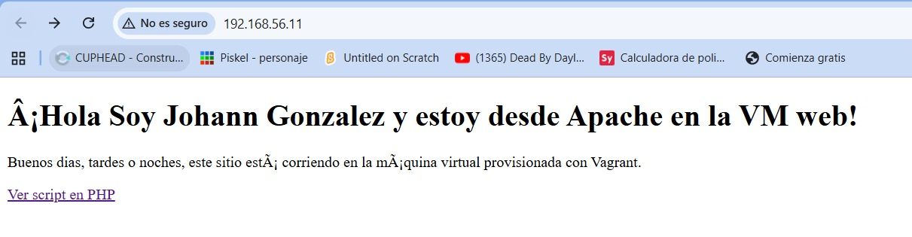
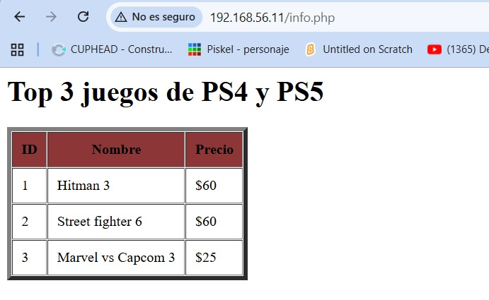
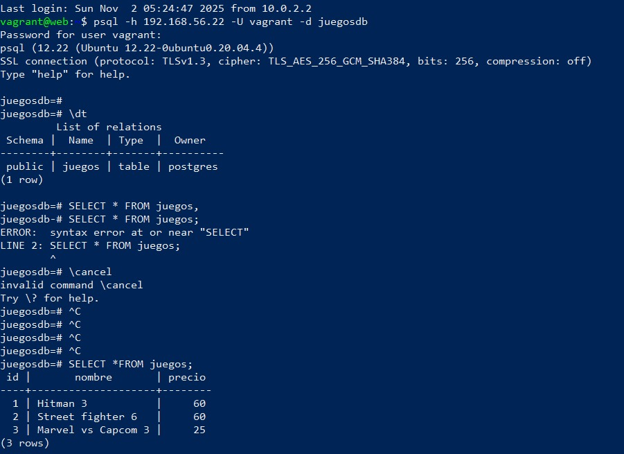

# Taller Vagrant + Provisionamiento con Shell

## Pasos para 

1. Ingrese al link e hice fork y cloné el repositorio para poder trabajar en el 

2. Dentro del archivo Vagrantfile cambie las ip de ambas maquinas virtuales para poder conectarme desde el host (192.168.56.11 para la web y 192.168.56.22 para la db)

3. Dentro de la maquina virtual web, se instalaron todos los paquetes requeridos que aparecian en el script provision-web.sh

4. Se modificó el archivo index.html desde visual studio para que mostrara un mensaje distinto y caracteristico el cual se puede ver en la pagina, no fue necesario copiar ni crear el archivo ya que este ya existia en la carpeta proporcionada por el profesor y se comprobó que se pudiera acceder al sitio con el ip que se le habia colocado con anterioridad al web

5. Se subieron los archivos al repositorio ya que el info.php ya estaba configurado por defecto

## Pasos
1. Clonar este repositorio.
2. Ejecutar `vagrant up` para levantar las máquinas.
3. Acceder a la máquina web en: http://192.168.56.10
4. Verificar `index.html` y `info.php`.

## Reto
- Completar `provision-db.sh` para instalar PostgreSQL.
- Crear una base de datos y tabla.
- Conectar la página PHP a la base de datos y mostrar datos.

## Pasos para realizar el reto
1. Primero se realizo lo pedido previamente al reto para despues completar el provision-db.sh con los comandos necesarios para provisionar la base de datos

2. Se ejecutaron los comandos del provision-db.sh y se verficó con el comando ``sudo -u postgres psql -d juegosdb -c "SELECT * FROM juegos;"``

3. Luego accedí a la maquina web saliendome de la db con el comando ``exit`` y entrando a esta con el comando ``vagrant ssh web``

4. Estando adentro de esta maquina virtual instale el postgresql con el comando ``sudo apt-get install -y php-pgsql``, luego reinicie la maquina con ``sudo systemctl restart apache2`` y por ultimo verifique si se habia instalado correctamente con el comando ``php -m | grep pgsql``

5. Se realizó lo mismo que en el paso 4 pero en la maquina de db 

6. Se verificó que el postgresql estuviera activo con el comando ``sudo systemctl status postgresql`` 

7. Para que postgreql acepte conexiones externas en el archivo postgresql.conf se modificó la linea de codigo que decia ``#listen_addresses = 'localhost'`` con el comando ``sudo nano /etc/postgresql/*/main/postgresql.conf`` por ``#listen_addresses = '*'`` 

8. Despues para que la maquina web se conectara a la base de datos (db) se modificó el archivo pg_hba.conf con el comando ``sudo nano /etc/postgresql/*/main/pg_hba.conf`` añadiendolé al final de este archivo la siguiente linea: ``host all all 192.168.56.0/24 md5`` para poder realizar la conexión con la base de datos, luego de esto para que se guardaran los cambios se usó el comando ``sudo systemctl restart postgresql`` y por ultimo se verificó que los cambios realizados hayan sido modificados con el ``sudo ss -tunlp | grep postgres``

9. En la maquina virtual de web instalé el cliente de postgre con el comando ``sudo apt-get install -y postgresql-client`` para luego entrar al shell de la base de datos con ``psql -h 192.168.56.22 -U vagrant -d juegosdb`` lo cual me pidio la contraseña de mi usuario para ingresar y al momento de ingresar la contraseña entré al shell e hice el comando ``\dt`` para mostrar y verificar la información de la base de datos y para ver la tabla con los datos que habia creado usé el comando ``SELECT *FROM juegos;``

10. Me salí de la base de datos con ``exit`` y estando en la maquina virtual de web usé el comando ``sudo apt-get update -y`` para actualizar la maquina virtual y luego para instalar el php y la conexión con apache usé el comando ``sudo apt-get install -y apache2 php libapache2-mod-php php-pgsql``

11. Luego para activar el servicio de apache se utlizó el comando ``sudo systemctl enable apache2`` y lo inicié con ``sudo systemctl start apache2`` para posteriormente copiar los archivos de una carpeta en otra con el comando ``sudo cp -r /vagrant/www/* /var/www/html/``

12. Por ultimo verifiqué lo hecho con anterioridad con el comando ``php -m | grep pgsql`` para ver el php y para ver el servicio de apache ``sudo systemctl status apache2``

## Los scripts utilizados fueron ``provision-db.sh`` y ``provision-web.sh`` los cuales habian sido provisionados por el profesor con anterioridad y el povision-db.sh fue modificado para poder realizar este reto como se pedia.

# Imagenes de los procesos funcionando

# Imagen del index.html

# Imagen del info.php

# Imagen de la tabla en el shell
